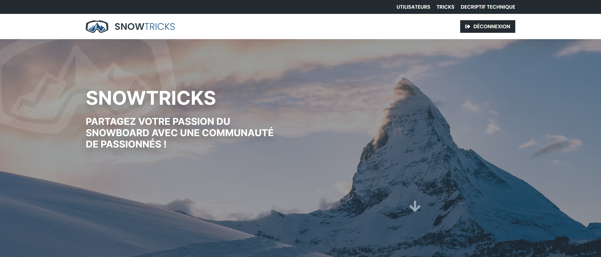

# OpenClassrooms
- Développeur d'application
- Parcours PHP/Symfony
- Projet 6

## Développez de A à Z le site communautaire SnowTricks



[](https://symfony.com/) [](https://twig.symfony.com/) [](https://getcomposer.org/) [](https://www.php.net/) [](https://developer.mozilla.org/fr/docs/Web/JavaScript) [](https://developer.mozilla.org/fr/docs/Web/CSS) [](https://www.diagrams.net/)

### À propos

Bonjour et bienvenue sur le dépôt de mon travail, qui traite du cinquième projet d'OpenClassrooms, intitulé **Développez de A à Z le site communautaire SnowTricks** ! Vous trouverez, ci-après, la procédure d'installation pour prendre en main le code du projet, ainsi que la base de données et sa structure, conçue pour fonctionner avec.

Vous trouverez également, dans le dossier **ressources/diagrams**, les diagrammes UML conçus en amont du projet, ainsi que le compte rendu de qualité de code, disponible en cliquant sur le bouton **Codacy**, présent ci-dessus.

[comment]: <> ([![Preview site]&#40;https://img.shields.io/badge/Preview%20site--89bf54?style=for-the-badge&logo=InternetExplorer&logoColor=white&#41;]&#40;https://florianjourde.com/&#41;)

---

## Remarque

Pour pouvoir installer ce projet, le gestionnaire de dépendance **Composer** doit être présent sur votre machine, un serveur local sous **PHP 7.4**, ainsi que le framework **Symfony** en version *5.4*. Si vous ne disposez pas de ces outils, vous pourrez les télécharger et les installer, en suivant ces liens :
- Télécharger [Composer](https://getcomposer.org/)
- Télécharger [Symfony](https://symfony.com/download)
- Télécharger [Wamp](https://www.wampserver.com/) (Windows)
- Télécharger [Mamp](https://www.wampserver.com/) (Mamp)

[comment]: <> (---)

[comment]: <> (## Installation)

[comment]: <> (1. À l'aide d'un terminal, créez un dossier à l'emplacement souhaité pour l'installation du projet. Lancez la commande suivante :)

[comment]: <> (```shell)

[comment]: <> (git clone https://github.com/FlorianJourde/OpenClassrooms-5-Create-your-first-blog-in-PHP.git)

[comment]: <> (```)

[comment]: <> (2. Lancez cette commande pour vous rendre dans le dossier adequat :)

[comment]: <> (```shell)

[comment]: <> (cd OpenClassrooms-5-Create-your-first-blog-in-PHP)

[comment]: <> (```)

[comment]: <> (3. À la racine de ce répertoire, lancez la commande suivante pour installer les dépendances Composer :)

[comment]: <> (```shell)

[comment]: <> (composer install)

[comment]: <> (```)

[comment]: <> (4. Vous devez maintenant modifier le fichier `DatabaseConnection.php` situé dans `\5-Blog-en-PHP\src\lib`. Remplacez `username`, `password`, ainsi qu'éventuellement `localhost` &#40;si nécéssaire&#41; par vos identifiants de base de données locale :)

[comment]: <> (```php)

[comment]: <> (<?php)

[comment]: <> (namespace Application\Lib;)

[comment]: <> (class DatabaseConnection)

[comment]: <> ({)

[comment]: <> (    public ?\PDO $database = null;)

[comment]: <> (    public function getConnection&#40;&#41;: \PDO)

[comment]: <> (    {)

[comment]: <> (        if &#40;$this->database === null&#41; {)

[comment]: <> (            $this->database = new \PDO&#40;'mysql:host=localhost;dbname=florianjourde;charset=utf8', 'username', 'password'&#41;;)

[comment]: <> (        })

[comment]: <> (        return $this->database;)

[comment]: <> (    })

[comment]: <> (})

[comment]: <> (```)

[comment]: <> (5. Ensuite, importez simplement le fichier `florianjourde.sql`, présent à la racine du projet, dans votre base de données SQL locale. Si toutes les informations ont correctement été renseignées, la connexion devrait se faire automatiquement.)

[comment]: <> (6. Créez votre hôte virtuel, pointant vers le dossier **public** du projet afin de pouvoir l'ouvrir avec une URL locale.)

[comment]: <> (7. Pour pouvoir tester les controllers, veuillez utiliser les identifiants par défaut :)

[comment]: <> (- Admin)

[comment]: <> (    - ID : admin@admin.com)

[comment]: <> (    - MDP : 123456)

[comment]: <> (- User)

[comment]: <> (    - ID : user@user.com)

[comment]: <> (    - MDP : 123456)

[comment]: <> (8. Si vous souhaitez pouvoir tester les emails directement depuis votre serveur local, il sera nécessaire d'utiliser [Fake Sendmail]&#40;https://www.glob.com.au/sendmail/&#41;. Je vous invite à suivre ce tutoriel, qui vous indiquera la procédure à suivre pour l'installer :)

[comment]: <> (- [Envoyer des mails en local avec Wamp]&#40;https://grafikart.fr/blog/mail-local-wamp&#41;)

[comment]: <> (Si vous utilisez Gmail et que vous rencontrez des problèmes de connexion au service, veuillez prêter attention au second commentaire, laissé par `hamza.essamami.sio@gmail.com`.)

### Merci pour votre attention !